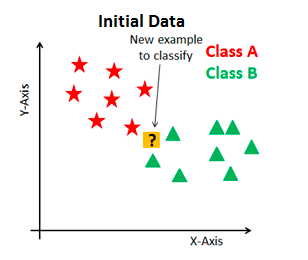
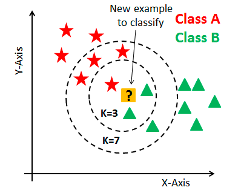

# Descrição do repositório

Este repositório armazena um notebook sobre o KNN, que é um algoritmo de classificação, contendo um estudo sobre esse tema desenvolvido no âmbito do grupo CiDAMO, com a orientação do Profº Lucas Pedroso. O notebook contém:

```
1 Introdução
2 Funcionamento do KNN
3 Preparação dos dados
4 Exemplo de treino e teste
5 Normalização
6 Escolha dos hiperparâmetros
  6.1 Motivação
  6.2 Tunagem
    6.2.1 Sobre o GridSearch
    6.2.2 K-Fold Cross Validation
    6.2.3 Hiperparâmetros do KNN
    6.2.4 GridSearch - sem normalização
    6.2.5 GridSearch - com normalização
7 Avaliação do modelo escolhido
  7.1 Sem normalização
  7.2 Com normalização
8 Conclusão
```

# Sobre o KNN

Para dar uma breve introdução sobre o KNN, considere a seguinte situação, onde temos dados da Classe A (vermelho), dados da Classe B (verde) e um dado novo que queremos classificá-lo (interrogação), que chamaremos de ponto P::



O método KNN faz o seguinte:

```
1. Calcula as distâncias do ponto P até todos os outros;
2. Encontra os K pontos/vizinhos mais próximos;
3. Atribui a P a classe que ocorre mais vezes dentre os K vizinhos mais próximos.
```

Abaixo, temos a ilustração para  K=3  e  K=7:



Na ilustração acima, note que:

* Para  K=3 , temos 2 vizinhos da Classe B e 1 vizinho da Classe A, então nessa situação, a classe de P seria B;

* Para  K=7 , temos 3 vizinhos da Classe B e 4 vizinhos da Classe A, então nessa situação, a classe de P seria A.

# Sobre o notebook

Neste notebook veremos a explicação mais detalhada do funcionamento do KNN e uma aplicação num conjunto de dados de celulares com tunagem usando o GridSearch. Também veremos o que é a normalização, como normalizamos os dados e será feita a comparação dos resultados com e sem a normalização.
